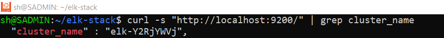
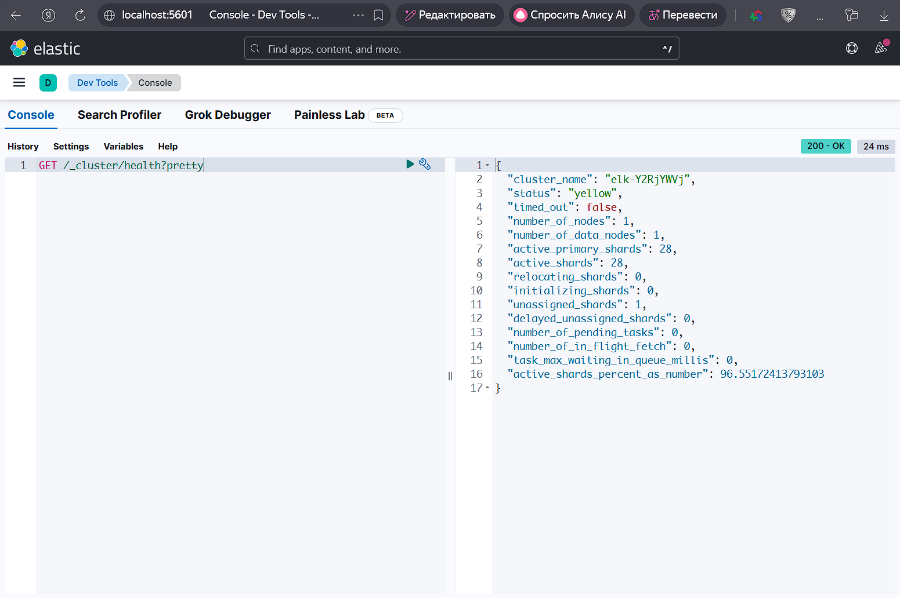
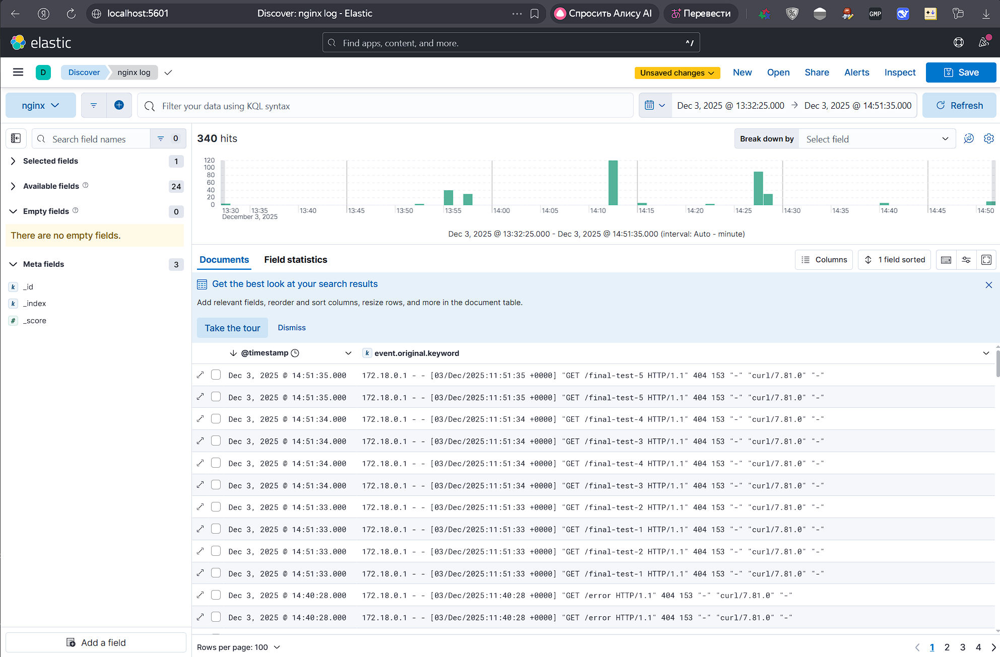

H/W for the lesson "ELK" - Alexey Motorin

# Домашнее задание к занятию "`ELK`" - `Алексей Моторин`

---

### Задание 1
`Скриншот-1 к заданию 1:`

---

### Задание 2

`Скриншот-1 к заданию 2:`

---

### Задание 3

`Скриншот-1 к заданию 2:`

---

### Задание 4

`Доброго времени суток. После запуска Filebeat и переключения поставки логов Nginx с Logstash на Filebeat. Мой стек ESK отказывается запускаться, нарушается очередность запуска контейнеров. Ввиду рабочей поездки не успеваю полностью сделать все задания...`
